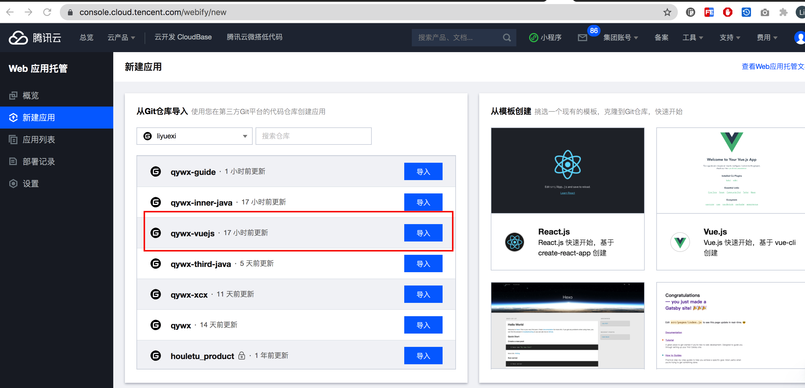
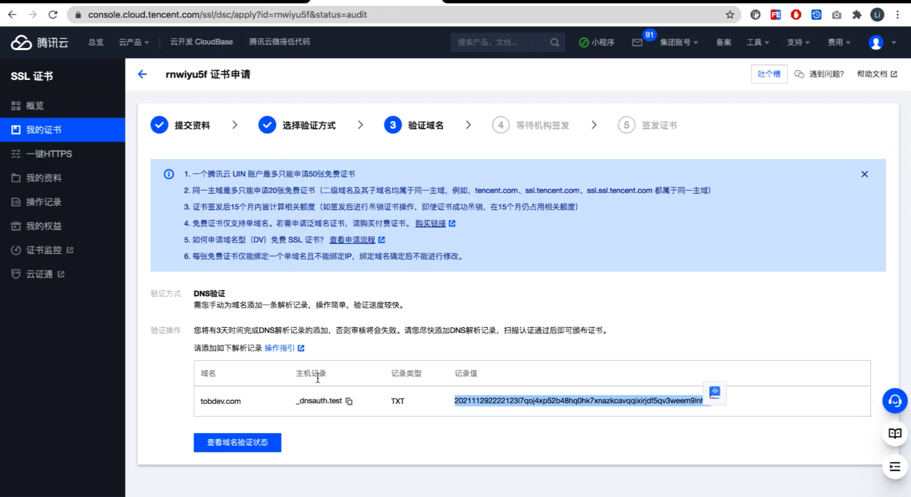

# 腾讯云webify应用托管
## 为什么使用腾讯云webify  
1， 提供默认域名、HTTPS、CDN 加速、可自定义域名(申请免费证书做域名解析即可)  
2，CICD：集成了多个代码托管平台（Github、Gitlab、Gitee 码云,Coding），可直接导入现有仓库，快速创建应用。内置 CI/CD 能力，推送至 Git 仓库，便可触发应用的构建和重新部署   
3，按量计费：底层使基于腾讯云开发 CloudBase 提供各项能力，Web 应用托管自身能力免费，应用按照其使用的 TCB 各项资源独立计费，如静态托管  
总结webify ：绑定代码托管平台+免费CICD+云开发环境支持

## 使用腾讯云webify托管gitee的vuejs3+vite项目
使用腾讯云webify托管gitee的vuejs3+vite项目并配置自定义域名(申请免费ssl证书并配置域名解析)

打开腾讯云官网 https://cloud.tencent.com/找到webify点立即使用

点gitee,登录并绑定gitee

webify会自动拉取gitee项目，选择自己的项目并进行创建及构建，中间会收到webify创建腾讯云开发按量付费环境的短信通知

webify发布会需要时间，发布成功后立即返回会404需等待发布完成，点击webify分配给我们的域名即可访问应用

在应用详情控制台我们可以看到计费的网站的存储量及cdn流量使用情况  

点所属环境我们可以看到webify将应用发布到了腾讯云开发创建的环境，其中静态网站可以看到我们vite+vuejs3环境产生的构建部署代码

加到webify应用详情点击应用设置，自定义域名设置添加域名

在自己域名所以的云服务商设置域名的cname指向，指向完成稍等dns生效即可访问

如果我们的自定义域名需要https支持，可以向腾讯云申请免费的ssl证书，流程如下

在自己域名所以的云服务商设置域名的txt指向，指向完成稍等dns生效即可访问

欢迎大家关注腾讯云云开发公众号及我本人公众号或者微信交流腾讯云云开发相关产品
